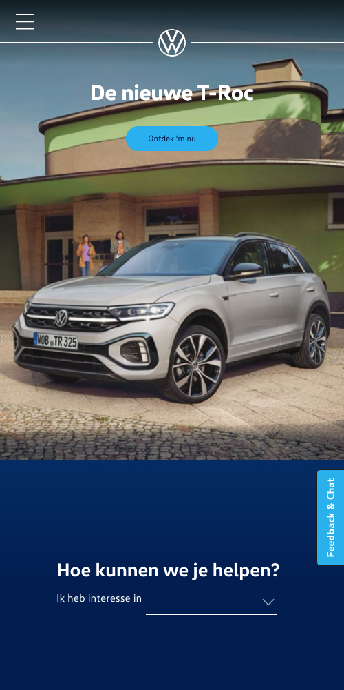
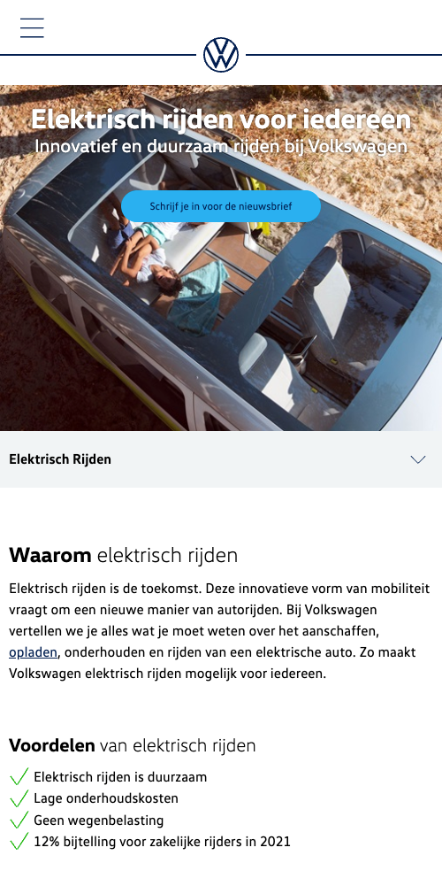
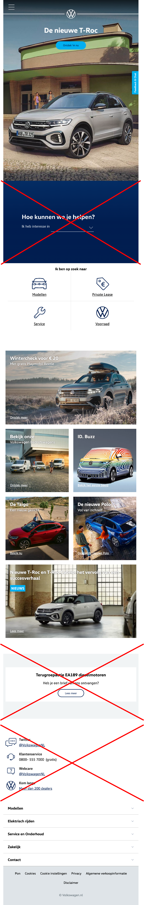
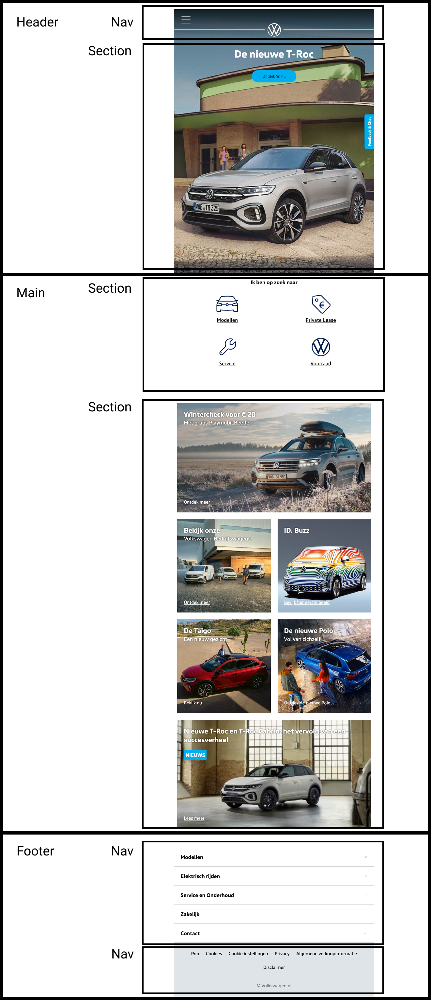
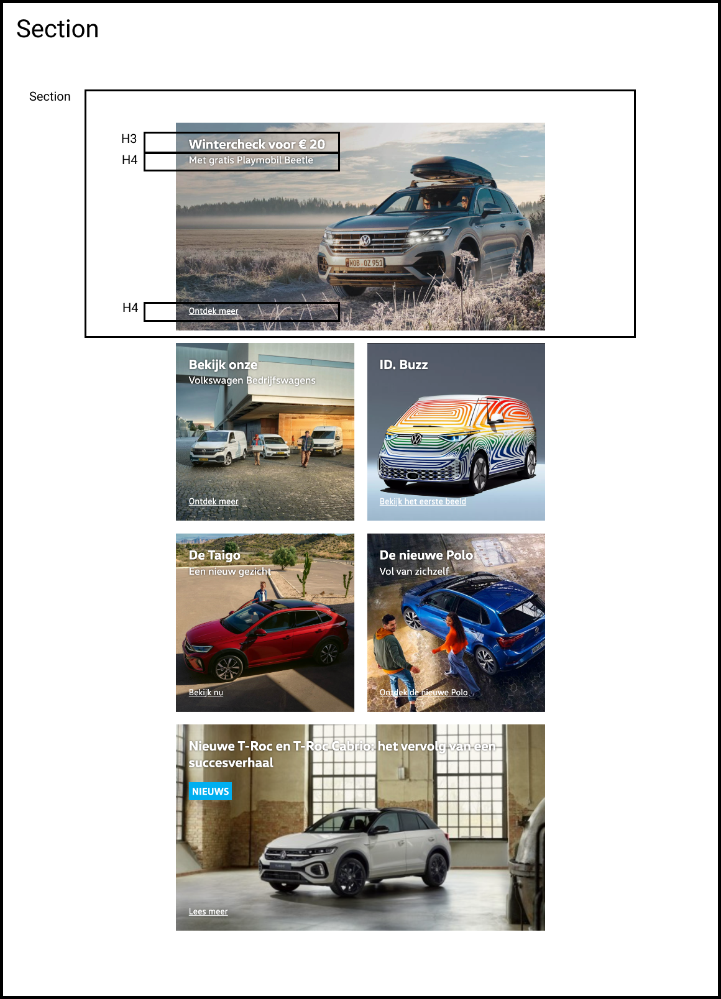
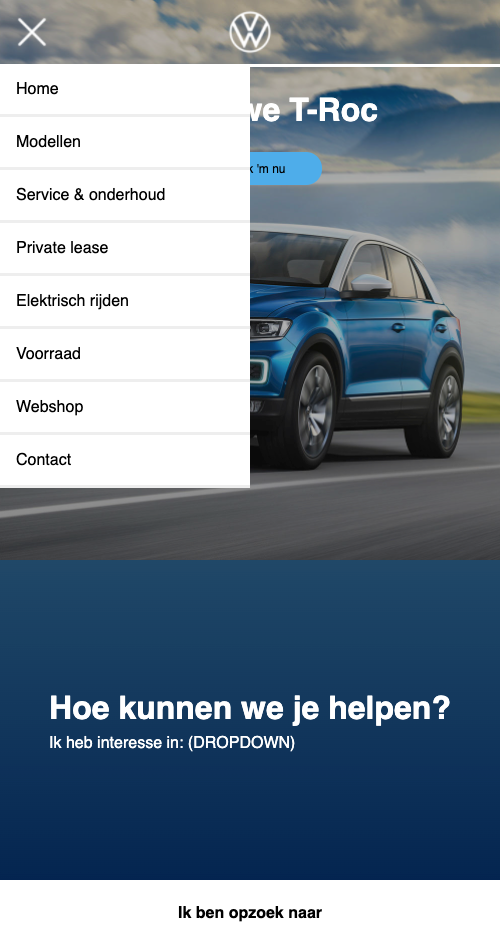
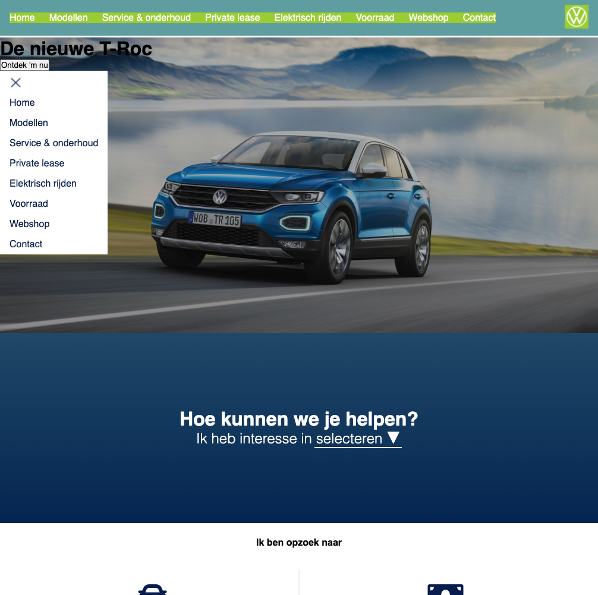
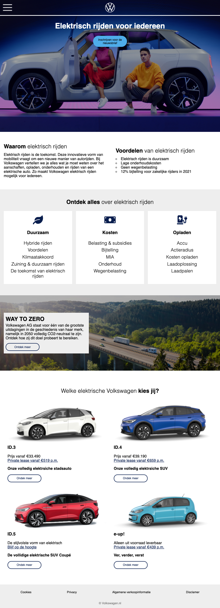

## Jij

uitwerken voor kick-off werkgroep

### Auteur:
Max van Liempdt

#### Je startniveau:
Rood

#### Je focus:
Fully responsive
 

## Je website

uitwerken voor kick-off werkgroep

### Je opdracht:
https://www.volkswagen.nl

#### Screenshot(s) van de eerste pagina (small screen): 
Home

#### Screenshot(s) van de tweede pagina (small screen):
Elektrisch rijden
 

 

## Breakdownschets (week 1)

uitwerken na afloop 2e werkgroep

### de hele pagina: 

### de structuur: 

### de content: 

## Voortgang 1 (week 2)

uitwerken voor 1e voortgang

### Stand van zaken
Ik ben eerst begonnen met een grove layout te ontwerpen in HTML/CSS. Dit zodat ik een overzicht krijg van alle belangrijkste elementen en makkelijker onderscheid kan maken. 

Die ziet er als volgt uit:

Vervolgens ben ik begonnen met de homepagina, die ben ik van boven naar beneden gaan ontwerpen. Wel heb ik ervoor gekozen het hambugermenu voor nu over te slaan, omdat hier waarschijnlijk nog meer uitleg over komt in de les. 

Dit is een screenshot van mijn eerste pagina om dit dit moment:

Tot nu toe heb ik geen vragen en ben ik nog niet vastgelopen tijdens het coderen.

### Agenda voor meeting
samen met je groepje opstellen

| Fleur | Anneke | Aris | Zoë | Max |
| --- | --- | --- | --- | --- |
| Geen vragen/prolemen | Geen vragen, loopt wat achter | Vraag over margin | Vraag over zoekbalk maken | Geen vragen/prolemen |

### Verslag van meeting
hier na afloop snel de uitkomsten van de meeting vastleggen

- Ik moet nog even wat huiswerk gaan inhalen, zodat ik wat nieuwe dingen leer om toe te passen in mijn website.
- Voor de rest gaat het prima en ben ik goed opweg.

## Voortgang 2 (week 3)

uitwerken voor 2e voortgang

### Stand van zaken
Deze week heb ik me vooral gefocused op het hamburger menu en mijn homepagina responsive maken. Ik had nog nooit een werkende hamburger menu gemaakt dus ik vond het in het begin vrij lastig. Gelukkig ben ik door de Humpty opdracht goed opweg geholpen.

Ik zat lang te struggelen met de menu icon en close icon. Uiteindelijk heb ik door te werken met visibility hidden/visible in de css en java ongveer bereikt wat ik wilde. Toch ben ik nog niet helemaal tevreden hoe het menu eruit ziet en ook denk ik dat er een betere manier is om de icons te wisselen. Hier is het uiteindelijke resultaat, volgende week ga ik proberen er nog wat beters van te maken.

Dit is hoe mijn home pagina er nu uit ziet:

- Ik wil nog een dropdown gaan maken onder het kopje "hoe kunnen we je helpen"
- En de banners zijn nu nog het hetzelfde maar dat worden natuurlijk 3 verschillende

### Agenda voor meeting
samen met je groepje opstellen

| Aris | Laurens | Zoë | Max |
| --- | --- | --- | --- |
| Vraag over gebruik van grid | Geen vragen/problemen | Geen vragen/problemen | Geen vragen/problemen |

### Verslag van meeting
hier na afloop snel de uitkomsten van de meeting vastleggen

- Ik loop een beetje achter, maar ik hoop dit weekend mijn eerste pagina volledig af te krijgen.
- Ik had niet echt vragen tot nu toe, maar ik heb wel wat tips gekregen van de student assisenten namelijk:
- Wees cosisent als het gaat om waardes (ik gebruik px, em, vw en procenten door elkaar)
- Ik kan de div's weghalen bij de banners op de homepagina en in plaats daarvan ul met li's gebruiken.

## Toegankelijkheidstest (week 4)

uitwerken na test in 8e voortgang

### Bevindingen
Deze week was de toegankelijkheidstest en hier zijn mijn bevindingen:

#### Screen reader test + tab test
Als eerst heb ik mijn site getest door te navigeren met de tab toets, vervolgens ben ik met de screen reader aan de slag gegaan.

Wat is me opgevallen?
- Kan het hamburger menu niet uitklappen met tab en enter
- Je kan door de navigatie heengaan met tab toets maar je ziet niet wat er gebeurt
- De headings met strong worden gek voorgelezen, soort van 2 keer
- Niet alle afbeelding worden voorgelezen (waarschijnlijk mist er alt tekst)
- De footer hebben nog geen linkjes

Wat ga ik fixen?
- Hamburger menu open en dicht klappen met tab en enter toets
- Alle alt teksten schrijven
- Linkjes maken in de footer

#### Combined loss diabetic eye disease bril test
Door deze bril zag ik veel kleine doorzichtige vlekjes die het lezen moeilijker maken.

Wat is me opgevallen?
- Home pagina section fonts kunnen wat groter
- Buttons mogen wat groter

#### Blur bril test
Door deze bril werd mijn zicht heel erg wazig en was het niet meer mogelijk de site te lezen.

Wat is me opgevallen?
- De site is totaal niet meer leesbaar
- Alleen grote afbeeldingen en de pagina titels kan ik met moeite zien

#### Parkinson simulatie test
Hier ging ik mijn site testen met een apparaatje op een arm die simuleert hoe het is om een vorm van parkinson te hebben.

Wat is me opgevallen?
- Site is te bedienen maar ik merk wel dat ik de knoppen en linkjes het liefst veel groter wil hebben. Ik moest bijvoorbeeld meerdere keren klikken om het menu uit te laten klappen. 
- Tijdens het scrollen had ik ook meerdere keren dat ik per ongeluk klikte terwijl ik dat niet wilde.

## Voortgang 3 (week 4)

uitwerken voor 3e voortgang

### Stand van zaken
Deze week moest er bij mij veel gaan gebeuren aan mijn website, doordat ik wat te traag heb gewerkt aan mijn eerste pagina. Ik ben er zeker van overtuigd dat ik alles optijd af ga krijgen, omdat ik bij de tweede pagina een aantal dingen kan kopieren en plakken van mijn eerste pagina. 

Alleerst heb ik de laatste aanpassingen gedaan aan mijn homepagina. Ik heb een volledig nieuwe navigatie gemaakt die ook goed responsive is. Het wisselen van de hamburger icon en close icon is nu niet meer nodig omdat het menu nu zit geplakt aan de bovenkant van de site.

Hier was ik bezig met mijn nieuwe navigatie ontwerpen:

Ik ben zeer tevreden over het eindresultaat van de navigatie. Dit is iets wat ik graag wilde kunnen vorig jaar en nu is het eindelijk gelukt.

Ook heb ik deze week mijn tweede pagina gemaakt en dit ging eigenlijk zonder al te veel moeite. Het scheelde dat ik niet opnieuw een header en navigatie moest maken, dus ik was hier niet heel tijd aan kwijt.

Dit is hoe mijn 2e pagina eruit ziet:

Als allerlaatst was het tijd om de website volledig responsive te gaan maken. Ik vond eigenlijk dat mijn website zonder enige media rules al erg responsive was. Dat komt doordat ik bijna overal heb gewerkt met flexbox. Toch zijn er hier en daar wat aanpassingen nodig om het op vooral op een laptop een beter uit te laten zien.

Ik heb doormiddel van media rules de flex-basis van elementen aangepast en de margin/paddings vergroot.
Ik ben tevreden hoe mijn website eruit ziet op mobiel, tablet en laptop scherm. Op de wat grotere beeldschermen vanaf 15inch is er zeker nog wel wat verbetering mogelijk. Helaas ben ik hier niet aan toe gekomen.

### Agenda voor meeting
samen met je groepje opstellen

| Aris | Laurens | Zoë | Max |
| --- | --- | --- | --- |
| Geen vragen/problemen  | Geen vragen/problemen | Geen vragen/problemen | Geen vragen/problemen |

Niemand had eigenlijk vragen, we hebben de meeting meer gebruikt voor laatste feedback en advies.

### Verslag van meeting
hier na afloop snel de uitkomsten van de meeting vastleggen

- Ik heb door de feedback nog een div kunnen verwijderen uit mijn html, dus dat is altijd fijn.

## Eindgesprek (week 5)

uitwerken voor eindgesprek

### Stand van zaken
Wat ging verrassend goed?
- Werken met flexbox ging beter dan ooit, vooral door de oefeningen uit week 1.
- De website responsive maken ging ook erg goed
- Veel geleerd over css positioning
- Geleerd hoe ik een hamburger menu werkend krijg met java

Wat was lastig/kon beter?
- Ik had in het begin wat problemen met afbeeldingen selecteren in css (begreep de folder structure niet helemaal)
- Website kan beter op grotere schermen (15inch en groter)
- Ik had beter bij moeten blijven met de opdrachten en de eerste 2 weken harder moeten werken aan mijn eigen website.

### Screenshot(s)

hier screenshot(s) van mijn eindresultaat:

Pagina 1 homepagina:

Pagina 2 elektrisch rijden:

## Bronnenlijst

continu bijhouden terwijl je werkt

Nb. Wees specifiek ('css-tricks' als bron is bijv. niet specifiek genoeg).

1. https://css-tricks.com/snippets/css/a-guide-to-flexbox/
2. https://codepen.io/shooft/pen/zYzKXxX
3. https://www.w3schools.com/css/css_positioning.asp
4. https://www.w3schools.com/css/css_dropdowns.asp
5. https://www.w3schools.com/css/css_display_visibility.asp
6. https://stackoverflow.com/questions/851724/css-background-image-what-is-the-correct-usage
7. https://css-tricks.com/almanac/properties/b/background-image/
8. https://fontawesome.com
9. https://www.flaticon.com
10. https://developer.mozilla.org/en-US/docs/Web/CSS/CSS_Flexible_Box_Layout/Basic_Concepts_of_Flexbox
11. https://flexboxfroggy.com/#nl
12. https://www.w3schools.com/css/css3_transitions.asp
13. https://developer.mozilla.org/en-US/docs/Web/CSS/transform-function/scale()
14. https://www.w3schools.com/cssref/css3_pr_transform.asp
15. https://www.volkswagen.nl

