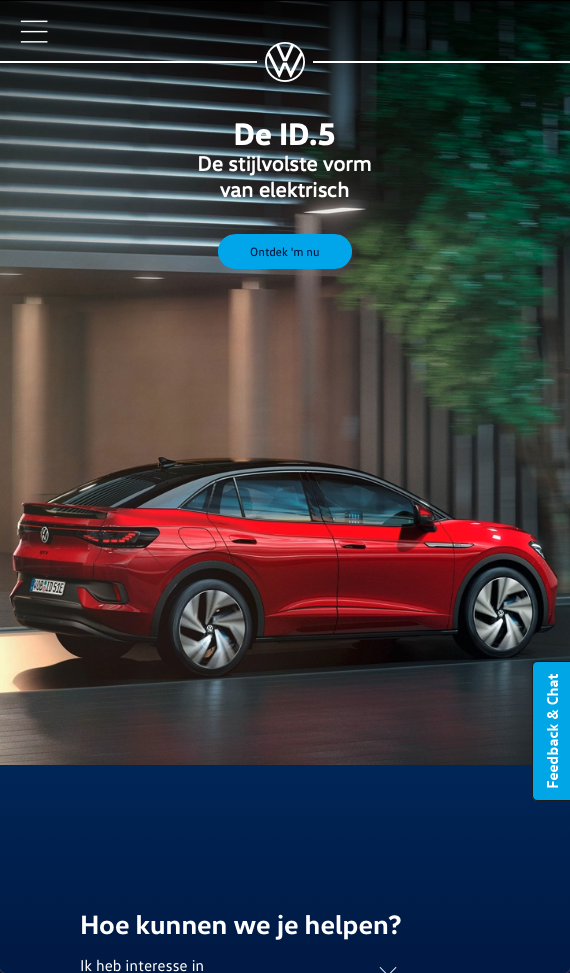
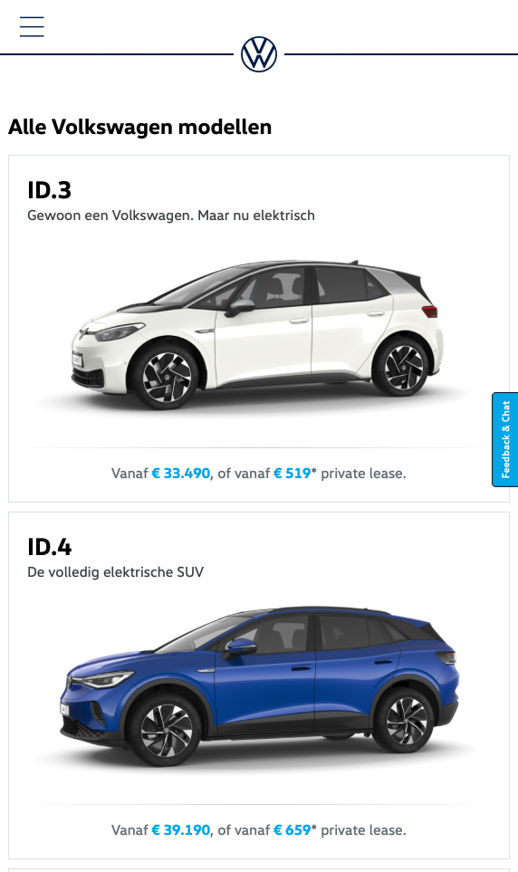
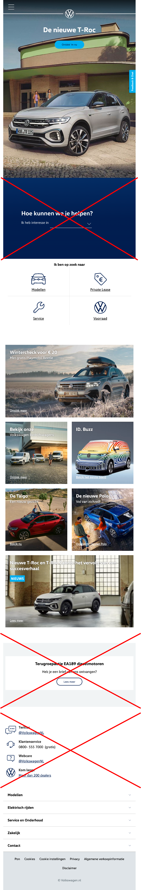
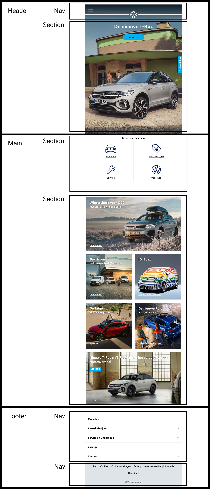
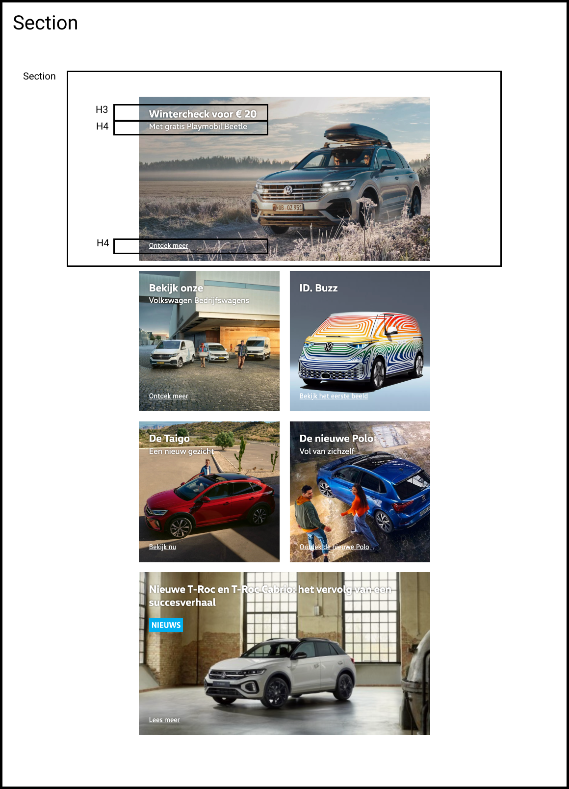
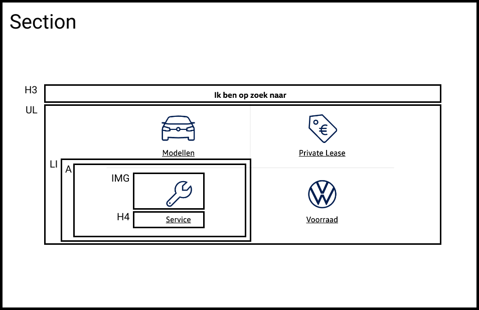
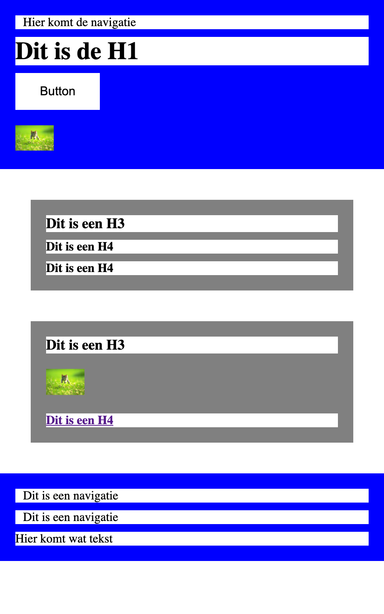
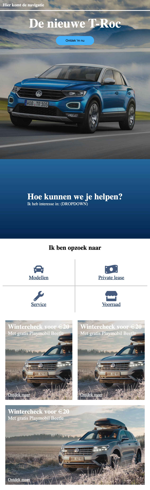

# Procesverslag
Markdown is een simpele manier om HTML te schrijven.  
Markdown cheat cheet: [Hulp bij het schrijven van Markdown](https://github.com/adam-p/markdown-here/wiki/Markdown-Cheatsheet).

Nb. De standaardstructuur en de spartaanse opmaak van de README.md zijn helemaal prima. Het gaat om de inhoud van je procesverslag. Besteedt de tijd voor pracht en praal aan je website.

Nb. Door *open* toe te voegen aan een *details* element kun je deze standaard open zetten. Fijn om dat steeds voor de relevante stuk(ken) te doen.

## Jij

uitwerken voor kick-off werkgroep

### Auteur:
Max van Liempdt

#### Je startniveau:
Rood

#### Je focus:
Fully responsive
 

## Je website

uitwerken voor kick-off werkgroep

### Je opdracht:
https://www.volkswagen.nl

#### Screenshot(s) van de eerste pagina (small screen): 
Home  

#### Screenshot(s) van de tweede pagina (small screen):
Modellen  

 

## Breakdownschets (week 1)

uitwerken na afloop 2e werkgroep

### de hele pagina: 

### de structuur: 

### de content: 

## Voortgang 1 (week 2)

uitwerken voor 1e voortgang

### Stand van zaken
Ik ben eerst begonnen met een grove layout te ontwerpen in HTML/CSS. Dit zodat ik een overzicht krijg van alle belangrijkste elementen en makkelijker onderscheid kan maken. Die ziet er als volgt uit:

Vervolgens ben ik begonnen met de homepagina die ik van boven naar beneden wil ontwerpen. Wel heb ik ervoor gekozen het hambugermenu voor nu over te slaan, omdat hier waarschijnlijk nog meer uitleg over komt in de les. Dit is een screenshot van mijn eerste pagina om dit dit moment:

Tot nu toe heb ik geen vragen en ben ik nog niet vastgelopen tijdens het coderen.

### Agenda voor meeting
samen met je groepje opstellen

| Fleur | Anneke | Aris | Zoë | Max |
| --- | --- | --- | --- | --- |
| Geen vragen/prolemen | Geen vragen, loopt wat achter | Vraag over margin | Vraag over zoekbalk maken | Geen vragen/prolemen |

### Verslag van meeting
hier na afloop snel de uitkomsten van de meeting vastleggen

- punt 1
- punt 2
- nog een punt
- ...

## Voortgang 2 (week 3)

uitwerken voor 2e voortgang

### Stand van zaken
hier dit ging goed & dit was lastig (neem ook screenshots op van delen van je website en code)

### Agenda voor meeting
samen met je groepje opstellen

| student 1      | student 2          | student 3    | student 4        |
| ---            | ---                | ---          | ---              |
| dit bespreken  | en dit             | en ik dit    | en dan ik dat    |
| en dat ook nog | dit als er tijd is | nog een punt | dit wil ik zeker |
| ...            | ...                | ...          | ...              |

### Verslag van meeting
hier na afloop snel de uitkomsten van de meeting vastleggen

- punt 1
- punt 2
- nog een punt
- ...

## Toegankelijkheidstest (week 4)

uitwerken na test in 8e voortgang

### Bevindingen
Lijst met je bevindingen die in de test naar voren kwamen:

#### Titel eerste bevinding
Hier korte omschrijving (met indien nodig een afbeelding)

Hier een omschrijving van hoe het opgelost kan worden (met indien nodig een afbeelding)

#### Titel tweede bevinding. 
Hier korte omschrijving (met indien nodig een afbeelding)

Hier een omschrijving van hoe het opgelost kan worden (met indien nodig een afbeelding)

#### Titel volgende bevinding. 
Hier korte omschrijving (met indien nodig een afbeelding)

Hier een omschrijving van hoe het opgelost kan worden (met indien nodig een afbeelding)

#### Titel nog een bevinding. 
Hier korte omschrijving (met indien nodig een afbeelding)

Hier een omschrijving van hoe het opgelost kan worden (met indien nodig een afbeelding)

## Voortgang 3 (week 4)

uitwerken voor 3e voortgang

### Stand van zaken
hier dit ging goed & dit was lastig (neem ook screenshots op van delen van je website en code)

### Agenda voor meeting
samen met je groepje opstellen

| student 1      | student 2          | student 3    | student 4        |
| ---            | ---                | ---          | ---              |
| dit bespreken  | en dit             | en ik dit    | en dan ik dat    |
| en dat ook nog | dit als er tijd is | nog een punt | dit wil ik zeker |
| ...            | ...                | ...          | ...              |

### Verslag van meeting
hier na afloop snel de uitkomsten van de meeting vastleggen

- punt 1
- punt 2
- nog een punt
- ...

## Eindgesprek (week 5)

uitwerken voor eindgesprek

### Stand van zaken
hier dit ging goed & dit was lastig (neem ook screenshots op van delen van je website en code)

### Screenshot(s)

hier screenshot(s) van je eindresultaat

## Bronnenlijst

continu bijhouden terwijl je werkt

Nb. Wees specifiek ('css-tricks' als bron is bijv. niet specifiek genoeg).

1. bron 1
2. bron 2
3. ...

